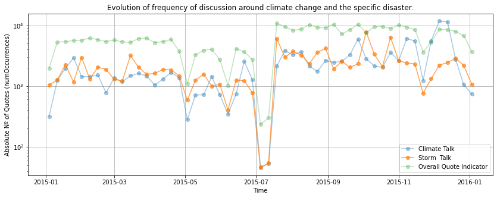
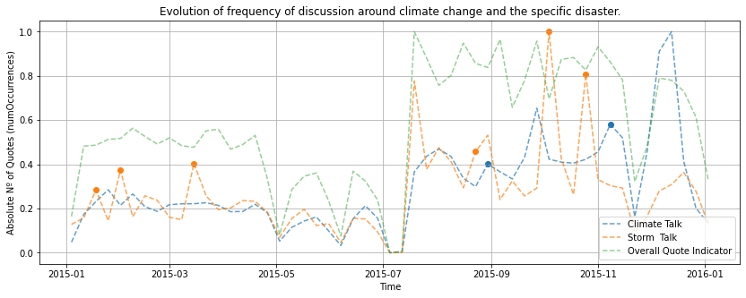

# Data Alchemy - ADA Project

# A simple statistic

Let's start this story with a single very simple statistic : 
- "The number of climate-related disasters has **tripled in the last 30 years**", *Oxfam International, 2020*

This drastic increase in the frequency but also the severity of natural climate-related disasters (floods, typhoons, wildfires, etc.) arises at the same time as the reality that is climate change and its effects start to set in. 

These natural disasters are maybe the most concrete repercussions yet of climate change, and we believe that concrete consequences are far more likely to get discussions and change going.

## Question

Thus, we wonder whether an increase in the severity of natural disasters leads to a broader discussion about climate change and its dangers ?  
And if it does, is it the same everywhere, or are there geographical discrepencies in the effect natural disasters have on the talk about climate change ?

# Do natural disasters drive discussions about climate change ? 

Generally no, some effects are seen but they are very small (p-value ?)
But we need to dive deeper and we see that there are 3 conditions for a natural disaster to cause talk about climate change.
- Type
- Location
- Severity / intensity

# We pick specific storms and heat waves, why ?

- articles with sources linking those events to climate change

Selected events based on the apparent link in Quotebank between talk about the event and about climate change. Visual inspection of the plots + Google trends to ensure the talks are in fact due to the event and not other climate related activities (conference, strike, speech, etc.)

## Description of the events

The first events we will consider are both heat waves from the year 2015. 

INDIA : https://en.wikipedia.org/wiki/2015_Indian_heat_wave  
During the month of may 2015, a severe heat wave struck India, with recorded temperatures nearing 50°C. Although the number of people affected is not well known, the heat wave caused at least 2500 casualties in multiple regions, making this heat wave the most deadly since 1979.

EUROPE : https://www.worldweatherattribution.org/european-heat-wave-july-2015/  
https://www.washingtonpost.com/outlook/2019/07/26/europes-killer-heat-waves-are-new-norm-death-rates-shouldnt-be/  
Unusual heat waves occurred in Europe from late June to mid-September 2015, with over 40°C measured locally, the highest temperatures measured since the beginning of the weather records in certain parts of Europe. The Maghreb Mediterranean coast, south-west, central and south-east Europe were particularly hard hit. Statistically in France, around 3300 deaths were attributed to this series of heat waves.

## Inspection of the data

## Description of the events

In the year 2016, being the warmest year on record, we will now compare the reactions to two heat waves in 2016, in the United States and India.

USA : https://www.huffpost.com/entry/record-heat-wildfires-west-us_n_57678bb4e4b015db1bc9be59?section=  
https://earthobservatory.nasa.gov/images/88547/extreme-heat-for-an-extreme-year  
This heat wave in the United States in July caused record temperatures in the Southwest, with "red flag warnings" for extreme fire conditions in effect across southern portions of California.  
During the peak of the heatwave, about 124 million people were under extreme heat warnings in the United States, according to the National Weather Service. 

INDIA : https://en.wikipedia.org/wiki/2016_Indian_heat_wave  
The 2016 Indian heat wave was a major heat wave in April and May of that year. A national record high temperature of 51.0 °C was set in the town of Phalodi, in the state of Rajasthan. Over 160 people died with 330 million affected to some degree. There were also water shortages with drought worsening the impact of the heat wave.

These two heatwaves seem very comparable in their effects and consequences, with both affecting at least a hundred million people. However, these comparable real consequences did not lead to a comparable effect on the discussion around climate change.

## Inspection of the data

## Description of the events

INDIA : https://en.wikipedia.org/wiki/Cyclone_Titli  
Cyclone Titli caused extensive damage to Eastern India and Bangladesh at the start of October 2018. Killing at least 85 people, it also caused nearly one billion dollars in damages during the single day it was on land.

USA : https://en.wikipedia.org/wiki/2017_Atlantic_hurricane_season  
The 2017 Atlantic hurricane season was an extremely active Atlantic hurricane season and the costliest on record, with a damage total of at least 290 billion dollars. The season featured 17 named storms, 10 hurricanes, and 6 major hurricanes. Most of the season's damage was due to hurricanes Harvey, Irma, and Maria.

Although these events are not of the same scale, we did notice that the talk surrounding them was significant enough to warrant a study. 
Also, Cyclone Titli occured around the same time as an IPCC special report on the impacts of global warming came out, making this study particularly difficult and interesting.

## Inspection of the data

## Description of the events

2019 Dorian end of august in Bahamas, close to US but no contact – No increase in climate change talk
Typhoon Hagibis 10 October 2019 in Japan – Relatively important increase in talk about climate change (drop in baseline number of quotes)

BAHAMAS : https://en.wikipedia.org/wiki/Hurricane_Dorian  
In September of 2019 during hurricane season, Hurricane Dorian became the worst natural disaster in The Bahamas' recorded history, with 74 deaths, 245 missing and over 3 billion dollars in damages.

JAPAN : https://en.wikipedia.org/wiki/Typhoon_Hagibis  
At the start of October 2019, the Typhoon Hagibis caused widespread destruction in Japan. It was the strongest typhoon to strike mainland Japan in decades, and one of the largest typhoons ever recorded. Japan's Fire and Disaster Management Agency stated that at least 98 people have been confirmed dead, 7 people are missing, with 346 people injured by the storm. More than 270,000 households lost power across the country. The total damages were estimated at over 15 billion dollars.

Although the typhoon in Japan caused more monetary damages, that is to be expected considering the size of the country. 

## Inspection of the data

# Synthesis

Map of the world showing that disasters in developping countries cause less talk about climate change. (India, Bahamas)

Disasters in developped countries cause more talk about climate change.
(Europe, USA, Japan)

This is the first question we wanted to answer.

*

We should keep in mind that we only have access to english quotes from Quotebank. Therefore, when comparing the impact of an indian heat wave on the global talk about climate change, we really look at the impact that heatwave has on the english-speaking world. All these studies would be completed by taking into account the talk about climate change generated all over the world in different languages. 