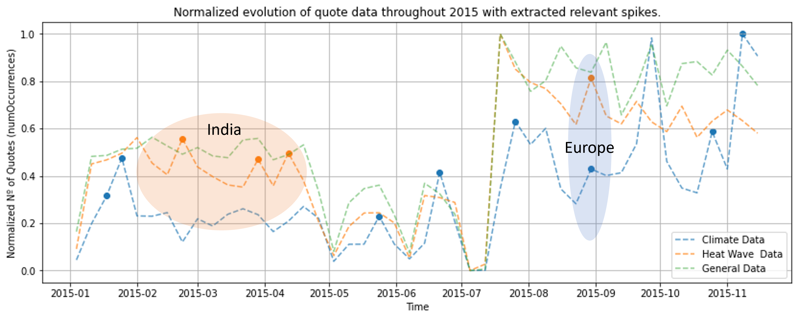
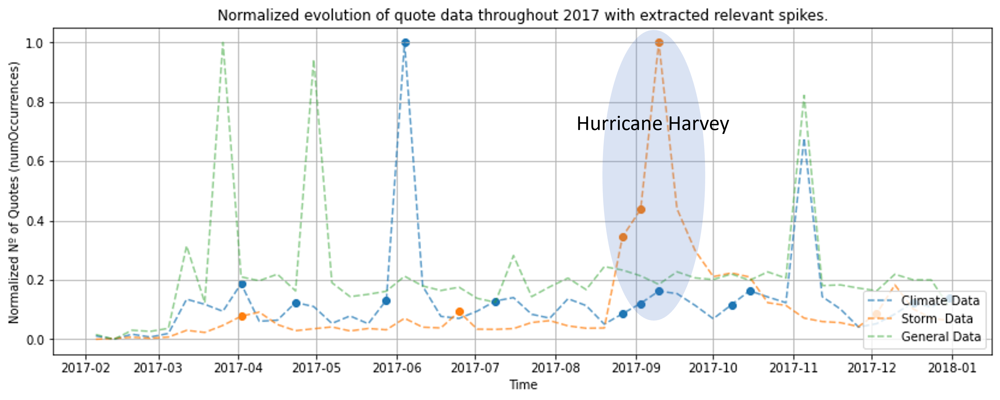
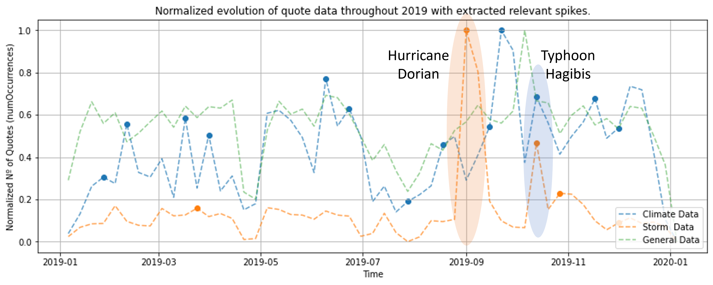

# Data Alchemy - ADA Project

# A simple statistic

Let's start this story with a single very simple statistic : 
- "The number of climate-related disasters has **tripled in the last 30 years**", *Oxfam International, 2020*

This drastic increase in the frequency but also the severity of natural climate-related disasters (floods, typhoons, wildfires, etc.) arises at the same time as the reality that is climate change and its effects start to set in. 

These natural disasters are maybe the most concrete repercussions yet of climate change, and we believe that concrete consequences are far more likely to get discussions and change going.

## Question

Thus, we wonder whether an increase in the severity of natural disasters leads to a broader discussion about climate change and its dangers ?  
And if it does, is it the same everywhere, or are there geographical discrepencies in the effect natural disasters have on the talk about climate change ?

# Do natural disasters drive discussions about climate change ? 

For the quotation dataset, we intercepted the data from 2019-01-01 to 2020-04-16 containing keyword “climate change”，"global warming","greenhouse effect" and "greenhouse gas".
This is because for the 2020's data, data are missing after April 16. For each day from 2019-01-01 to 2020-04-09, 
we give this date two metrics that represents the reporting intensity of climate change for the week after this date,
 "num_quota" represents how many different quotes about climate change were generated during the week, and "total_occur" represents the total number of these quotes occur, respectively.

From the following statistics, we can conclude that the occurrence of disasters has played a minimal role 
in triggering discussions on topics related to climate change, etc.

<table class="MsoTableGrid" border="1" cellspacing="0" cellpadding="0" style="border-collapse:collapse;border:none;mso-border-alt:solid windowtext .5pt;
 mso-yfti-tbllook:1184;mso-padding-alt:0cm 5.4pt 0cm 5.4pt">
 <tbody><tr style="mso-yfti-irow:0;mso-yfti-firstrow:yes">
  <td width="184" valign="top" style="width:138.25pt;border:solid windowtext 1.0pt;
  mso-border-alt:solid windowtext .5pt;padding:0cm 5.4pt 0cm 5.4pt">
  
The week after a disaster happen

  </td>
  <td width="184" valign="top" style="width:138.25pt;border:solid windowtext 1.0pt;
  border-left:none;mso-border-left-alt:solid windowtext .5pt;mso-border-alt:
  solid windowtext .5pt;padding:0cm 5.4pt 0cm 5.4pt">
  
Number of different quota

  </td>
  <td width="184" valign="top" style="width:138.3pt;border:solid windowtext 1.0pt;
  border-left:none;mso-border-left-alt:solid windowtext .5pt;mso-border-alt:
  solid windowtext .5pt;padding:0cm 5.4pt 0cm 5.4pt">
  
Total time of related occurrence

  </td>
 </tr>
 <tr style="mso-yfti-irow:1">
  <td width="184" valign="top" style="width:138.25pt;border:solid windowtext 1.0pt;
  border-top:none;mso-border-top-alt:solid windowtext .5pt;mso-border-alt:solid windowtext .5pt;
  padding:0cm 5.4pt 0cm 5.4pt"><pre style="background:white;vertical-align:
  baseline;word-break:break-all">Mean<o:p></o:p></pre></td>
  <td width="184" valign="top" style="width:138.25pt;border-top:none;border-left:
  none;border-bottom:solid windowtext 1.0pt;border-right:solid windowtext 1.0pt;
  mso-border-top-alt:solid windowtext .5pt;mso-border-left-alt:solid windowtext .5pt;
  mso-border-alt:solid windowtext .5pt;padding:0cm 5.4pt 0cm 5.4pt"><pre style="background:white;vertical-align:baseline;word-break:break-all">805.947368<o:p></o:p></pre></td>
  <td width="184" valign="top" style="width:138.3pt;border-top:none;border-left:
  none;border-bottom:solid windowtext 1.0pt;border-right:solid windowtext 1.0pt;
  mso-border-top-alt:solid windowtext .5pt;mso-border-left-alt:solid windowtext .5pt;
  mso-border-alt:solid windowtext .5pt;padding:0cm 5.4pt 0cm 5.4pt"><pre style="background:white;vertical-align:baseline;word-break:break-all">2831.807018<o:p></o:p></pre></td>
 </tr>
 <tr style="mso-yfti-irow:2">
  <td width="184" valign="top" style="width:138.25pt;border:solid windowtext 1.0pt;
  border-top:none;mso-border-top-alt:solid windowtext .5pt;mso-border-alt:solid windowtext .5pt;
  padding:0cm 5.4pt 0cm 5.4pt"><pre style="background:white;vertical-align:
  baseline;word-break:break-all">Median<o:p></o:p></pre></td>
  <td width="184" valign="top" style="width:138.25pt;border-top:none;border-left:
  none;border-bottom:solid windowtext 1.0pt;border-right:solid windowtext 1.0pt;
  mso-border-top-alt:solid windowtext .5pt;mso-border-left-alt:solid windowtext .5pt;
  mso-border-alt:solid windowtext .5pt;padding:0cm 5.4pt 0cm 5.4pt"><pre style="background:white;vertical-align:baseline;word-break:break-all">851.0<o:p></o:p></pre></td>
  <td width="184" valign="top" style="width:138.3pt;border-top:none;border-left:
  none;border-bottom:solid windowtext 1.0pt;border-right:solid windowtext 1.0pt;
  mso-border-top-alt:solid windowtext .5pt;mso-border-left-alt:solid windowtext .5pt;
  mso-border-alt:solid windowtext .5pt;padding:0cm 5.4pt 0cm 5.4pt"><pre style="background:white;vertical-align:baseline;word-break:break-all">2794.0<o:p></o:p></pre></td>
 </tr>
 <tr style="mso-yfti-irow:3">
  <td width="184" valign="top" style="width:138.25pt;border:solid windowtext 1.0pt;
  border-top:none;mso-border-top-alt:solid windowtext .5pt;mso-border-alt:solid windowtext .5pt;
  padding:0cm 5.4pt 0cm 5.4pt"><pre style="background:white;vertical-align:
  baseline;word-break:break-all">Std<o:p></o:p></pre></td>
  <td width="184" valign="top" style="width:138.25pt;border-top:none;border-left:
  none;border-bottom:solid windowtext 1.0pt;border-right:solid windowtext 1.0pt;
  mso-border-top-alt:solid windowtext .5pt;mso-border-left-alt:solid windowtext .5pt;
  mso-border-alt:solid windowtext .5pt;padding:0cm 5.4pt 0cm 5.4pt"><pre style="background:white;vertical-align:baseline;word-break:break-all">286.382326<o:p></o:p></pre></td>
  <td width="184" valign="top" style="width:138.3pt;border-top:none;border-left:
  none;border-bottom:solid windowtext 1.0pt;border-right:solid windowtext 1.0pt;
  mso-border-top-alt:solid windowtext .5pt;mso-border-left-alt:solid windowtext .5pt;
  mso-border-alt:solid windowtext .5pt;padding:0cm 5.4pt 0cm 5.4pt"><pre style="background:white;vertical-align:baseline;word-break:break-all">1234.498893<o:p></o:p></pre></td>
 </tr>
 <tr style="mso-yfti-irow:4">
  <td width="184" valign="top" style="width:138.25pt;border:solid windowtext 1.0pt;
  border-top:none;mso-border-top-alt:solid windowtext .5pt;mso-border-alt:solid windowtext .5pt;
  padding:0cm 5.4pt 0cm 5.4pt"><pre style="background:white;vertical-align:
  baseline;word-break:break-all">Min<o:p></o:p></pre></td>
  <td width="184" valign="top" style="width:138.25pt;border-top:none;border-left:
  none;border-bottom:solid windowtext 1.0pt;border-right:solid windowtext 1.0pt;
  mso-border-top-alt:solid windowtext .5pt;mso-border-left-alt:solid windowtext .5pt;
  mso-border-alt:solid windowtext .5pt;padding:0cm 5.4pt 0cm 5.4pt"><pre style="background:white;vertical-align:baseline;word-break:break-all">161.000000 <o:p></o:p></pre></td>
  <td width="184" valign="top" style="width:138.3pt;border-top:none;border-left:
  none;border-bottom:solid windowtext 1.0pt;border-right:solid windowtext 1.0pt;
  mso-border-top-alt:solid windowtext .5pt;mso-border-left-alt:solid windowtext .5pt;
  mso-border-alt:solid windowtext .5pt;padding:0cm 5.4pt 0cm 5.4pt"><pre style="background:white;vertical-align:baseline;word-break:break-all">215.000000<o:p></o:p></pre></td>
 </tr>
 <tr style="mso-yfti-irow:5;mso-yfti-lastrow:yes">
  <td width="184" valign="top" style="width:138.25pt;border:solid windowtext 1.0pt;
  border-top:none;mso-border-top-alt:solid windowtext .5pt;mso-border-alt:solid windowtext .5pt;
  padding:0cm 5.4pt 0cm 5.4pt"><pre style="background:white;vertical-align:
  baseline;word-break:break-all">Max<o:p></o:p></pre></td>
  <td width="184" valign="top" style="width:138.25pt;border-top:none;border-left:
  none;border-bottom:solid windowtext 1.0pt;border-right:solid windowtext 1.0pt;
  mso-border-top-alt:solid windowtext .5pt;mso-border-left-alt:solid windowtext .5pt;
  mso-border-alt:solid windowtext .5pt;padding:0cm 5.4pt 0cm 5.4pt"><pre style="background:white;vertical-align:baseline;word-break:break-all">1904.000000<o:p></o:p></pre></td>
  <td width="184" valign="top" style="width:138.3pt;border-top:none;border-left:
  none;border-bottom:solid windowtext 1.0pt;border-right:solid windowtext 1.0pt;
  mso-border-top-alt:solid windowtext .5pt;mso-border-left-alt:solid windowtext .5pt;
  mso-border-alt:solid windowtext .5pt;padding:0cm 5.4pt 0cm 5.4pt"><pre style="background:white;vertical-align:baseline;word-break:break-all">7142.000000<o:p></o:p></pre></td>
 </tr>
</tbody></table>

<table class="MsoTableGrid" border="1" cellspacing="0" cellpadding="0" style="border-collapse:collapse;border:none;mso-border-alt:solid windowtext .5pt;
 mso-yfti-tbllook:1184;mso-padding-alt:0cm 5.4pt 0cm 5.4pt">
 <tbody><tr style="mso-yfti-irow:0;mso-yfti-firstrow:yes">
  <td width="184" valign="top" style="width:138.25pt;border:solid windowtext 1.0pt;
  mso-border-alt:solid windowtext .5pt;padding:0cm 5.4pt 0cm 5.4pt">
  
The week after each day(base line)

  </td>
  <td width="184" valign="top" style="width:138.25pt;border:solid windowtext 1.0pt;
  border-left:none;mso-border-left-alt:solid windowtext .5pt;mso-border-alt:
  solid windowtext .5pt;padding:0cm 5.4pt 0cm 5.4pt">
  
Number of different quota

  </td>
  <td width="184" valign="top" style="width:138.3pt;border:solid windowtext 1.0pt;
  border-left:none;mso-border-left-alt:solid windowtext .5pt;mso-border-alt:
  solid windowtext .5pt;padding:0cm 5.4pt 0cm 5.4pt">
  
Total time of related occurrence

  </td>
 </tr>
 <tr style="mso-yfti-irow:1">
  <td width="184" valign="top" style="width:138.25pt;border:solid windowtext 1.0pt;
  border-top:none;mso-border-top-alt:solid windowtext .5pt;mso-border-alt:solid windowtext .5pt;
  padding:0cm 5.4pt 0cm 5.4pt"><pre style="background:white;vertical-align:
  baseline;word-break:break-all">Mean<o:p></o:p></pre></td>
  <td width="184" valign="top" style="width:138.25pt;border-top:none;border-left:
  none;border-bottom:solid windowtext 1.0pt;border-right:solid windowtext 1.0pt;
  mso-border-top-alt:solid windowtext .5pt;mso-border-left-alt:solid windowtext .5pt;
  mso-border-alt:solid windowtext .5pt;padding:0cm 5.4pt 0cm 5.4pt"><pre style="background:white;vertical-align:baseline;word-break:break-all">812.446121<o:p></o:p></pre></td>
  <td width="184" valign="top" style="width:138.3pt;border-top:none;border-left:
  none;border-bottom:solid windowtext 1.0pt;border-right:solid windowtext 1.0pt;
  mso-border-top-alt:solid windowtext .5pt;mso-border-left-alt:solid windowtext .5pt;
  mso-border-alt:solid windowtext .5pt;padding:0cm 5.4pt 0cm 5.4pt"><pre style="background:white;vertical-align:baseline;word-break:break-all">2801.952586<o:p></o:p></pre></td>
 </tr>
 <tr style="mso-yfti-irow:2">
  <td width="184" valign="top" style="width:138.25pt;border:solid windowtext 1.0pt;
  border-top:none;mso-border-top-alt:solid windowtext .5pt;mso-border-alt:solid windowtext .5pt;
  padding:0cm 5.4pt 0cm 5.4pt"><pre style="background:white;vertical-align:
  baseline;word-break:break-all">Median<o:p></o:p></pre></td>
  <td width="184" valign="top" style="width:138.25pt;border-top:none;border-left:
  none;border-bottom:solid windowtext 1.0pt;border-right:solid windowtext 1.0pt;
  mso-border-top-alt:solid windowtext .5pt;mso-border-left-alt:solid windowtext .5pt;
  mso-border-alt:solid windowtext .5pt;padding:0cm 5.4pt 0cm 5.4pt"><pre style="background:white;vertical-align:baseline;word-break:break-all">848.0<o:p></o:p></pre></td>
  <td width="184" valign="top" style="width:138.3pt;border-top:none;border-left:
  none;border-bottom:solid windowtext 1.0pt;border-right:solid windowtext 1.0pt;
  mso-border-top-alt:solid windowtext .5pt;mso-border-left-alt:solid windowtext .5pt;
  mso-border-alt:solid windowtext .5pt;padding:0cm 5.4pt 0cm 5.4pt"><pre style="background:white;vertical-align:baseline;word-break:break-all">2787.0<o:p></o:p></pre></td>
 </tr>
 <tr style="mso-yfti-irow:3">
  <td width="184" valign="top" style="width:138.25pt;border:solid windowtext 1.0pt;
  border-top:none;mso-border-top-alt:solid windowtext .5pt;mso-border-alt:solid windowtext .5pt;
  padding:0cm 5.4pt 0cm 5.4pt"><pre style="background:white;vertical-align:
  baseline;word-break:break-all">Std<o:p></o:p></pre></td>
  <td width="184" valign="top" style="width:138.25pt;border-top:none;border-left:
  none;border-bottom:solid windowtext 1.0pt;border-right:solid windowtext 1.0pt;
  mso-border-top-alt:solid windowtext .5pt;mso-border-left-alt:solid windowtext .5pt;
  mso-border-alt:solid windowtext .5pt;padding:0cm 5.4pt 0cm 5.4pt"><pre style="background:white;vertical-align:baseline;word-break:break-all">274.371415<o:p></o:p></pre></td>
  <td width="184" valign="top" style="width:138.3pt;border-top:none;border-left:
  none;border-bottom:solid windowtext 1.0pt;border-right:solid windowtext 1.0pt;
  mso-border-top-alt:solid windowtext .5pt;mso-border-left-alt:solid windowtext .5pt;
  mso-border-alt:solid windowtext .5pt;padding:0cm 5.4pt 0cm 5.4pt"><pre style="background:white;vertical-align:baseline;word-break:break-all">1185.697827<o:p></o:p></pre></td>
 </tr>
 <tr style="mso-yfti-irow:4">
  <td width="184" valign="top" style="width:138.25pt;border:solid windowtext 1.0pt;
  border-top:none;mso-border-top-alt:solid windowtext .5pt;mso-border-alt:solid windowtext .5pt;
  padding:0cm 5.4pt 0cm 5.4pt"><pre style="background:white;vertical-align:
  baseline;word-break:break-all">Min<o:p></o:p></pre></td>
  <td width="184" valign="top" style="width:138.25pt;border-top:none;border-left:
  none;border-bottom:solid windowtext 1.0pt;border-right:solid windowtext 1.0pt;
  mso-border-top-alt:solid windowtext .5pt;mso-border-left-alt:solid windowtext .5pt;
  mso-border-alt:solid windowtext .5pt;padding:0cm 5.4pt 0cm 5.4pt"><pre style="background:white;vertical-align:baseline;word-break:break-all">158.000000<o:p></o:p></pre></td>
  <td width="184" valign="top" style="width:138.3pt;border-top:none;border-left:
  none;border-bottom:solid windowtext 1.0pt;border-right:solid windowtext 1.0pt;
  mso-border-top-alt:solid windowtext .5pt;mso-border-left-alt:solid windowtext .5pt;
  mso-border-alt:solid windowtext .5pt;padding:0cm 5.4pt 0cm 5.4pt"><pre style="background:white;vertical-align:baseline;word-break:break-all">205.000000<o:p></o:p></pre></td>
 </tr>
 <tr style="mso-yfti-irow:5;mso-yfti-lastrow:yes">
  <td width="184" valign="top" style="width:138.25pt;border:solid windowtext 1.0pt;
  border-top:none;mso-border-top-alt:solid windowtext .5pt;mso-border-alt:solid windowtext .5pt;
  padding:0cm 5.4pt 0cm 5.4pt"><pre style="background:white;vertical-align:
  baseline;word-break:break-all">Max<o:p></o:p></pre></td>
  <td width="184" valign="top" style="width:138.25pt;border-top:none;border-left:
  none;border-bottom:solid windowtext 1.0pt;border-right:solid windowtext 1.0pt;
  mso-border-top-alt:solid windowtext .5pt;mso-border-left-alt:solid windowtext .5pt;
  mso-border-alt:solid windowtext .5pt;padding:0cm 5.4pt 0cm 5.4pt"><pre style="background:white;vertical-align:baseline;word-break:break-all">2070.000000<o:p></o:p></pre></td>
  <td width="184" valign="top" style="width:138.3pt;border-top:none;border-left:
  none;border-bottom:solid windowtext 1.0pt;border-right:solid windowtext 1.0pt;
  mso-border-top-alt:solid windowtext .5pt;mso-border-left-alt:solid windowtext .5pt;
  mso-border-alt:solid windowtext .5pt;padding:0cm 5.4pt 0cm 5.4pt"><pre style="background:white;vertical-align:baseline;word-break:break-all">7804.000000<o:p></o:p></pre></td>
 </tr>
</tbody></table>

But we need to dive deeper and we see that there are 4 conditions for a natural disaster to cause talk about climate change.

- Severity 

We wanted to explore whether there was a correlation between the severity of the disaster and the discussion of climate change over the same period.
So firstly, We give the emdat dataset four new metrics, "death score","affected score","damage score" and " severity score", 
Severity score is a combination of "death score","affected score" and "damage score" that assesses the overall bad impact caused by a natural disaster.

We used two methods to evaluate the correlations, calculating correlation coefficients and p-values, using scatter plots for visual analysis.
We plotted scatter plots for each of the four natural disaster assessment metrics and the total number of quotations and their total occurrences in the coming week, 
and calculated their correlation coefficients and p-values.

From scatter map, Correlation coefficient and p value, We found there's no correlation between the severity of the disaster and the intensity of discussion on the topic of climate change. 
The only slight link to the intensity of discussion on climate change related topics is property damage.

The plot and result is following:

Correlation coefficient between severe score and num_quota  r is =  0.056，p value is =  0.678

Correlation coefficient between severe score and total_occur  r is =  0.099，p value is =  0.462

Correlation coefficient between death score and num_quota  r is = -0.076，p value is =  0.572

Correlation coefficient between affected score and num_quota  r is = -0.043，p value is =  0.753

Correlation coefficient between damage score and num_quota  r is =  0.262，p value is =  0.049

Correlation coefficient between death score and total_occur  r is = -0.061，p value is =  0.650

Correlation coefficient between affected score and total_occur  r is =  0.049，p value is =  0.720

Correlation coefficient between damage score and total_occur  r is =  0.247，p value is =  0.064

- Location

We assessed each country and region based on three metrics: the total severity of natural disasters that occurred in those countries during the statistical time, the total number of quotes about climate change that occurred at the same time as those natural disasters, and their total number of occurrences.
From developed and developing countries, we see two very different models. 

Following is the analysis results by region:

(The more upward the blue bar, the greater the total severity of natural disasters suffered by the area during the statistical time, and vice versa. The more upward the blue bar, the greater the total severity of natural disasters suffered by this area during the statistical time, and vice versa. The higher the green and red bars, the higher the intensity of the discussion on climate change related topics in the region at the corresponding time, and vice versa.)
 

 
 

 

  

From the results we can conclude that developed countries have experienced less severe natural disasters, but that these natural disasters have led to more discussions about climate change. Meanwhile, developing countries have experienced more severe natural disasters, but these have generated less discussion.

In addition to the difference between developed and developing countries, another hypothesis about this phenomenon is that because this is an English-language dataset, the quotes and discussions are based on Anglo countries, each of country has more concerns about climate change because of natural disasters that occur within their own country or in more closely connected countries.
People will always pay more attention to things they can perceive.

Two other conclusions from the country-based analysis are that 1. natural disasters in smaller countries are less likely to generate public concern about climate change, a typical example being Fiji. 2. natural disasters in countries where fewer people speak English also generate less discussion about climate change, typical examples being Russia and China, as analyzed from this English-language dataset.

- Big event

We did a time-based analysis of the discussion on climate change, as shown below, and found several clear dips and downward trends.
For the decline in late April 2019, we suspect it may be due to the fire event of Notre Dame at that time, this event diverted people's attention from other things. the decline in late 2019 and early 2020 is due to Covid-19.
We can see the same trend in Google Trends.

# Case study on two specific types of natural disasters

We decide to take a closer look at two specific types of natural disasters: storms (e.g., hurricanes, typhoons, ...) and heat waves. This choice for this ultimately boils down to the fact that both [storms](https://www.c2es.org/content/hurricanes-and-climate-change/) and [heat waves](https://www.c2es.org/content/heat-waves-and-climate-change/) are natural disasters which have likely worsened due to climate change over the past decades. 

In the following sections, a comparison is made between discussion around the topic of climate change (climate data) and a general type of natural disaster (disaster data), either storms or heat waves. We plot the weekly-binned number of occurrences over the course of a year. One can be tempted to conclude that an observed increase in both would mean that the natural disaster caused an increase in discussion around climate change, however many factors can come into play. Real world factors could be climate summits and strikes or the release of a major climate report. On a more technical level though, the overall amount of quotes in the Quotebank dataset can fluctuate over time, meaning that an observed increase in the quotes related to climate change might be due to an increase in the overall number of quotes retrieved during that time window, rather than being due to a actual increase in quotes in the real world.

We attempt to account for the fluctuation in overall quotes retrieved over a time period by picking a common english word ('especially') which is broad enough to appear in many different contexts but not so broad that a subset of the Quotebank dataset which contains this token is too big to load into memory. The idea is that this subset of Quotebank (general data) is able to represent the general evolution of the number of quotes throughout a given time frame.

By including the general data, it can, for certain years, become blatantly obvious that spikes in the climate and disaster data happen simply because there is an increase in overall number of quotes because the evolution of all three quote occurrences follow an identical trend. The goal is to identify the parts of the climate and disaster data which increase for a reason other than there simply being a sudden increase in overall number quotes by leveraging the general data. 

In order to reach the aforementioned goal, we define a method for extracting so-called 'relevant spikes'. These are spikes in the climate and disaster related data which go against the trend of the general data, or surpass it by an adjustable parameter. For example, if the general data stays stable over the course of a few weeks, but the climate data experiences a sharp increase, we could decide to identify as a relevant spike. Whether or not the spike is due to a particular disaster is irrelevant at this stage, we simply want to identify spikes in the data which are likely caused by some effect from the real world.

The task of determining if a (supposedly) real world increase in climate data is related to a real world increase in disaster data is part of what the next sections try to tackle. Through a series of comparisons between events of a given disaster type occurring in different places, we try to determine the main factors that can create a causal relationship between the disaster (and discussion around it) and discussion around climate change. The hypotheses developed try to keep in mind that Quotebank was extracted from news articles in English, meaning that most quotes will originate from Western media and countries such as the United States, the United Kingdom, Canada and Australia. Of course, there are news English-speaking news outlets in many different countries, for example India, but the balance is uneven. 

To select the individual disasters we select those that correspond to relevant spikes in the disaster data. We verify these spikes by looking for a similar pattern in Google Trends. In addition to verifying that the trends match, this tool will also often produce the specific natural disaster that occurred by checking the related queries. Additionally, the specific natural disasters and their properties can be verified using Wikipedia, notably, we made use of the [List of heat waves](https://en.wikipedia.org/wiki/List_of_heat_waves#2015) article. When selecting the disasters to compare, we look for the ones that cause an increase in climate discussion and those that don't. The goal of the analysis is to determine why two similar disasters could produce such different results in the climate data.

## Description of the events

The first events we will consider are both heat waves from the year 2015. 

INDIA :  
During the month of may 2015, a severe [heat wave](https://en.wikipedia.org/wiki/2015_Indian_heat_wave) struck India, with recorded temperatures nearing 50°C. Although the number of people affected is not well known, the heat wave caused at least 2500 casualties in multiple regions, making this heat wave the most deadly since 1979.

EUROPE :  
Unusual [heat](https://www.worldweatherattribution.org/european-heat-wave-july-2015/) [waves](https://www.washingtonpost.com/outlook/2019/07/26/europes-killer-heat-waves-are-new-norm-death-rates-shouldnt-be) occurred in Europe from late June to mid-September 2015, with over 40°C measured locally, the highest temperatures measured since the beginning of the weather records in certain parts of Europe. The Maghreb Mediterranean coast, south-west, central and south-east Europe were particularly hard hit. Statistically in France, around 3300 deaths were attributed to this series of heat waves.

## Inspection of the data

Regarding the heat wave in India, we can notice a relevant spike at the end of April due to a slight increase in heat wave quotes which is stronger than that of the general data. There is no corresponding relevant spike in the climate data, on the contrary, there is a sharp decrease. The spike in heat wave data towards the end of August corresponds mainly to heat waves that affected Europe. There is a corresponding relevant spike that can be observed in the climate data.

These results lead us to make the following hypotheses. Firstly, that a heat wave occurring in India doesn't attract the same level of attention (based on the spike magnitudes) as heat waves in Europe because Western media tends to have a stronger reaction to something when it happens geographically close to it. Secondly, the discussion around climate change might not increase as a result of a heat wave in India because they are more common there than in Europe. According to WHO: ["In India  Heat waves typically occur from March to June"](https://www.who.int/india/heat-waves). 

Combining these two together, we can conclude that, in regards to heat waves, when this type of disaster happens in a developing country, such as [India](https://www.worlddata.info/developing-countries.php), Western media's reaction is non negligible, but there is no apparent increase in climate discussion. When, on the other hand, a heat wave takes place in Europe, it can generate climate discussion because the event is happening where the Western media is based and so there is a stronger need to find solutions to mitigate future similar events. When a heat wave takes place in India, the effects are not directly experienced by the Western media.

## Description of the events

We will now look into hurricanes from 2017 and 2018 in the United States as well as cyclone in India.

USA :  
[Hurricane Harvey](https://en.wikipedia.org/wiki/Hurricane_Harvey) was a devastating Category 4 hurricane that made landfall on Texas and Louisiana in August 2017, causing catastrophic flooding, more than 100 deaths and inflicting $125 billion in property damage.

INDIA :  
[Cyclone Titli](https://en.wikipedia.org/wiki/Cyclone_Titli) caused extensive damage to Eastern India and Bangladesh at the start of October 2018. Killing at least 85 people, it also caused nearly one billion dollars in damages during the single day it was on land.

USA :  
[Hurricane Florence](https://en.wikipedia.org/wiki/Hurricane_Florence) was a powerful hurricane that caused catastrophic damage in the Carolinas in September 2018. 
Overall, the storm caused $24.23 billion in damage and 54 deaths.

Although these events are not of the same scale, we did notice that the talk surrounding them was significant enough to warrant a study. 
Also, Cyclone Titli occured around the same time as an IPCC special report on the impacts of global warming came out, making this study particularly difficult and interesting.

## Inspection of the data

For this analysis, we start by noticing a (series of) relevant spike(s) in early September 2017 which coincide with the relevant spikes of Hurricane Harvey. The relevant spikes of the climate data are not extremely pronounced, but they are nevertheless non negligible. Secondly, looking at the normalized plot from 2018, we identify two main storm spikes, one for Hurricane Florence in September, and one for Cyclone Titli. For Hurricane Florence, we see a relevant spike in the climate data coinciding with the storm. The same is true for Cyclone Titli.

Firstly, when inspecting trends on Google Trends, we noticed something [interesting](https://trends.google.com/trends/explore?date=2017-08-29%202017-09-29&q=%2Fm%2F0d063v) when considering the topic 'Climate Change' during the month of September 2019. Under 'Related queries' we noticed several 'Breakout' queries (defined by Google as: Results marked 'Breakout' had a tremendous increase, probably because these queries are new and had few (if any) prior searches) such as: "climate change hurricanes" and "does global warming cause hurricanes". However, this result was not reproducible in the month of September 2018. Our hypothesis is that the hurricane season of 2017 was the first one where the average person started to question whether or not hurricanes could be linked to climate change. This is likely due to the extremely devastating nature of the storm. Then, the following year, the increase in quotes related to climate change during the hurricane season was more pronounced because, at this point, the relationship between climate change and extreme storms had 'caught on' in mainstream media. We reinsist on the fact that this is merely our interpretation of the data at hand. 

Secondly, we can compare the two relevant spikes in the climate data that coincide with the two storms. As we have said, relevant spikes aim to identify increases that occur in the real world, but these real world causes remain to be determined. As stated previously, we hypothesize that the spike occurring with Hurricane Florence is due to the hurricane itself. In the case of Cyclone Titli, it just so happens that an IPCC special report on the impacts of global warming was released a couple days prior, meaning that we can exclude the possibility that the spike is due to the report. If it is the case that the report caused the spike, or some of it, it would make sense to conclude, similarly to the analysis of the heat waves from 2015, that Western media tends to have a smaller reaction in terms of climate change discussion when it comes to a natural disaster that takes place in a developing country. 

These results lead us to make the following hypotheses. Firstly, that a heat wave occurring in India doesn't attract the same level of attention (based on the spike magnitudes) as heat waves in Europe because Western media tends to have a stronger reaction to something when it happens geographically close to it. Secondly, the discussion around climate change might not increase as a result of a heat wave in India because they are more common there than in Europe. According to WHO: ["In India  Heat waves typically occur from March to June"](https://www.who.int/india/heat-waves). 

Combining these two together, we can conclude that, in regards to heat waves, when this type of disaster happens in a developing country, such as [India](https://www.worlddata.info/developing-countries.php), Western media's reaction is non negligible, but there is no apparent increase in climate discussion. When, on the other hand, a heat wave takes place in Europe, it can generate climate discussion because the event is happening where the Western media is based and so there is a stronger need to find solutions to mitigate future similar events. When a heat wave takes place in India, the effects are not directly experienced by the Western media.

## Description of the events

Finally we turn our interest towards two storms from fall 2019: a typhoon in Japan and a Hurricane in the Bahamas.

BAHAMAS :  
In September of 2019 during hurricane season, [Hurricane Dorian](https://en.wikipedia.org/wiki/Hurricane_Dorian) became the worst natural disaster in The Bahamas' recorded history, with 74 deaths, 245 missing and over 3 billion dollars in damages.

JAPAN :  
At the start of October 2019, the [Typhoon Hagibis](https://en.wikipedia.org/wiki/Typhoon_Hagibis) caused widespread destruction in Japan. It was the strongest typhoon to strike mainland Japan in decades, and one of the largest typhoons ever recorded. Japan's Fire and Disaster Management Agency stated that at least 98 people have been confirmed dead, 7 people are missing, with 346 people injured by the storm. More than 270,000 households lost power across the country. The total damages were estimated at over 15 billion dollars.

Although the typhoon in Japan caused more monetary damages, that is to be expected considering the size of the country. 

## Inspection of the data

In the plot from 2019 we can see that there are two main spikes in the fall. The first one corresponds to Hurricane Dorian and the second with Typhoon Hagibis. For Hurricane Dorian there is no associated relevant spike in the climate data. This is not the case for Typhoon Hagibis, which does coincide with a relevant spike in the climate data.

There is no major related climate event, such as a climate report or speech, which took place during Typhoon Hagibis. Additionally, checking Google Trends for its duration [reveals](https://trends.google.com/trends/explore?date=2019-10-10%202019-10-30&q=%2Fm%2F0d063v) a search for "global warming countermeasures" in Japanese (地球 温暖 化 対策). Taking both of these facts into account, we hypothesize that that the relevant spike in climate data in October 2019 is due to the Typhoon Hagibis taking place. Secondly, we hypothesize that the lack of a relevant spike in climate data during Hurricane Dorian might be because it effects were mainly felt in small countries such as the Bahamas, which regularly experience this specific type of natural disaster. 

We conclude with the following hypotheses. The typhoon that hit Japan, a developed country, in October 2019 was extremely devastating, causing an increase in discussion around climate change because it was extremely impactful and because Japan can be regarded as part of the Western world, therefore attracting the attention of Western media. On the other hand, the hurricane that hit The Bahamas, also a developed country, did not spark the same kind of discussion around climate change because it is an event that occurs frequently and in a predictable pattern. 

Note that the spike in climate data that reaches 1.0 at the end of September 2019 is due to the [September 2019 climate strikes](https://en.wikipedia.org/wiki/September_2019_climate_strikes).

## General conclusions about the data analysis 

Just because a natural disaster gets a lot of attention does not necessarily mean that it will drive climate change discussion, and there are several reasons for this. One reason is that a certain type of natural disaster might be common in parts of the world, meaning that quotes pertaining to governments advising the population to stay hydrated for example will occur frequently, but no discussion around climate change will be started because of how common the event is. 
Another is that a natural disaster might not be devastating enough to catch the attention of major public figures. In the case of Quotebank, it is likely the case that the event would have to capture the attention of major public figures from the Western world to garner any significant reaction.

One of the main takeaways from the analysis is that for a natural disaster to cause any type of significant discussion around climate change, it must both be extremely devastating or extreme and occur in a part of the Western world. We emphasize here that, since these analyses largely base themselves on the Quotebank dataset, the reactions analyzed are those from mainly Western media since we consider only English quotes. Therefore, it makes intuitive sense that a natural disaster must shock the Western by taking place in it.

# Synthesis

To finish and try to answer the question we asked ourselves at the beginning of this data journey, we believe that there is a strong discrepency between climate change talk after a natural disaster according to the country of origin of the disaster itself.  
To show this, hereafter is a map of the world on which we placed the locations of the disasters we mentioned above (for India we took one of the two studied events). We then added for each event the discussion about said event we found in Quotebank, and on top of that we added the intensity of the discussion about climate change generated as a result of this event. 
This map gives us a clearer picture of **where a natural disaster should occur** if it wants to induce discussion around the topic of climate change.

All the data we have points towards 3 conditions for a natural disaster to induce discussions about climate change, in ascending order of importance :
- The **type** of event, as long as it is associated with climate change
- The **severity** of the event
- The **location** of the event

Then, the events least likely to induce discussions could be forest fires of small intensity in a developping country.  
The events most likely to induce discussions would be storms or heat waves of extreme intensity in developped countries.

There is therefore an **inherent egocentrical view** when linking natural disasters to climate change. Although the events all over the world point towards global warming, only those near to one will actually make one think about the direct effects it is having on one's life, and thus accelerate discussions.  
Let's also not forget that having a quotebank made up entirely of english quotes does not make this task easier, and probably accentuates even more this couldn't-care-less attitude that we witness when an event does not occur close to home.

# 